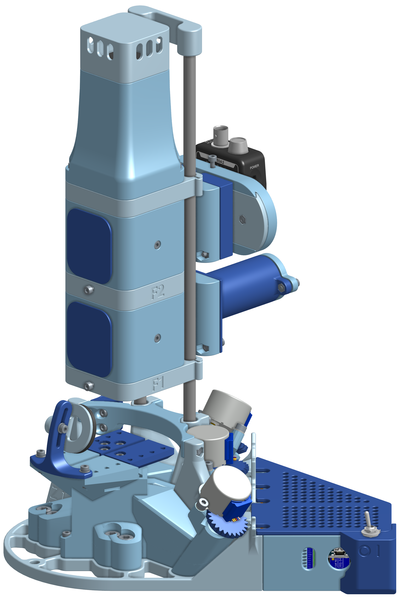

# Confocal Displacement Sensing

> **Affordable confocal displacement measurement.**
> *Confocal Displacements Sensing voor betaalbare verplaatsingsmetingen*



    

A Bachelor End Project (BEP) for the **Precision and Micro-Engineering** track at TU Delft (course `WBMT3BEP`, project code `PME-2026-A06`).
Submission: **June 12th 2026**.

**Team:** Dafne Gyselinck · Jayden Jhagru · Harmen Klerk · Ties van Lohuizen · Stef Wiegman

> 🧱 **Built on top of the [OpenFlexure Block Stage](https://openflexure.org/projects/blockstage/)** (CC BY-SA 4.0). We use the block stage **unmodified**: our confocal optics, stepper actuators, electronics housing, and software bolt onto it as a clip-on extension. If you already own an OpenFlexure Block Stage, you only need to print our additional parts. See [Built on top of](#-built-on-top-of) for details and attribution.

---

## 🔗 Project Hub

Everything we made for this project lives behind one of these links.

| Deliverable | Link | What's inside |
|---|---|---|
| 📄 Research paper | [🚧 TODO](#) <!-- TODO: paste paper URL (Overleaf share / PDF on Drive) --> | Theoretical background, confocal model derivation (appendix A), measurement results, discussion |
| 🎥 Assembly video | [YouTube](https://www.youtube.com/watch?v=UzMbLptgHZc) | Step-by-step build from printed parts and electronics to a working instrument |
| 📐 CAD files | [`cad/`](cad/) | 38 STEP source files for every printed part of the confocal extension, grouped by category (BASE / BLOCKS / CALIBRATION) |
| 🔧 Wiring guide | [`docs/wiring.md`](docs/wiring.md) | Arduino pin-out, ULN2003 IN2/IN3-swap, power, Moku and camera connections |
| 🛒 Parts list (BOM) | [`docs/bom.xlsx`](docs/bom.xlsx) | Electronics, optics, mechanical hardware, quantities, suppliers, prices (Excel, download to view) |
| 🖨️ 3D-print guide | [`docs/print-guide.pdf`](docs/print-guide.pdf) | Printer settings, per-part list with print times, filament estimates, tolerances |
| 📖 Use guide | [`docs/use-guide.md`](docs/use-guide.md) | First-time setup, calibration, manual burst, automatic scan, analysis, troubleshooting |
| 🧱 Block stage origin | [openflexure.org/projects/blockstage](https://openflexure.org/projects/blockstage/) | Upstream open-hardware base, required reading before fabrication |
| 💻 Source code | this repository | PySide6 desktop UI, Arduino firmware, scan/burst pipeline, confocal physics model |

---

## What is this?

A complete, low-cost **confocal displacement measurement instrument**, built from four parts:

- An **unmodified [OpenFlexure Block Stage](https://openflexure.org/projects/blockstage/)** as the 3-axis flexure base
- Our custom **confocal optical column** (two lenses, pinhole aperture, photodetector) that bolts onto the block stage
- Our **stepper actuators, electronics, and illumination** that also mount to the unmodified stage
- A desktop application that ties it all together for live alignment, manual measurements, and automatic raster scans

The instrument **measures sub-micron axial displacement** (vertical position changes smaller than 1 µm) at one point on a sample, then walks the probe over a grid to build a spatial map. At each stand-still point the photodetector records a high-speed voltage burst (a few milliseconds at ≥1 MSa/s); offline FFT analysis turns each burst into a vibration spectrum.

The goal is to deliver this capability at a small fraction of the cost of commercial confocal displacement sensors, making the technology accessible for academic and small-lab settings.

A natural application, and our demonstration case, is **vibration-frequency mapping of MEMS devices**: each burst's spectrum becomes one point in a 3D dataset `(x, y, frequency) → amplitude`.

### Glossary

If terms below are new to you, this short table covers the rest of the README:

| Term | What it means here |
|---|---|
| **Confocal** | Optical setup where the illumination spot and detector pinhole share a common focus, gives the system its high axial (Z-axis) sensitivity |
| **Burst** | A short (few ms) high-rate sample of photodetector voltage taken at one stand-still position |
| **dz1** | Axial (Z) displacement of the sample from a reference plane, in mm |
| **I0** | Photodetector voltage at the reference plane; used to normalise the voltage → displacement conversion |
| **MEMS** | Micro-Electro-Mechanical Systems, micrometer-scale moving structures whose vibrations we characterise |
| **Moku:Go** | Liquid Instruments' multifunction lab instrument; we use its Oscilloscope and Datalogger modes as our photodetector front-end |
| **Flexure stage** | A stage that moves via elastic flexion of monolithic features instead of sliding bearings, sub-micron repeatable, see OpenFlexure |

### Pick your starting point

- **Reading the paper?** Start with the [research paper](#-project-hub), then the [Hardware overview](#hardware-overview) for the optical setup.
- **Building a copy?** Read [Built on top of](#-built-on-top-of) first, then open the [3D-print guide](docs/print-guide.pdf), [BOM](docs/bom.xlsx), [wiring guide](docs/wiring.md), and watch the [assembly video](https://www.youtube.com/watch?v=UzMbLptgHZc).
- **Running an existing instrument?** Jump to [Prerequisites](#prerequisites) and [Quickstart](#quickstart), then the [use guide](docs/use-guide.md).
- **Hacking the software?** See [Repository layout](#repository-layout).

---

## Prerequisites

Before the software will do anything useful, make sure you have:

| Need | Why | How to verify |
|---|---|---|
| **Python ≥ 3.10** | UI + scan pipeline | `python --version` |
| **Git** | clone repo | `git --version` |
| **Arduino IDE** (or `arduino-cli`) | flash the Nano firmware once | open IDE, plug in Nano |
| **Moku:Go** + Liquid Instruments account | photodetector readout | reachable at `192.168.73.1` after connecting to its Access-Point Wi-Fi or Ethernet |
| **USB webcam** (UVC, ≥1080p) | live view of sample on the camera tab | shows up in your OS's camera app |
| **Assembled hardware** | otherwise the UI starts but cannot measure | see [3D-print guide](docs/print-guide.md), [wiring guide](docs/wiring.md), and the [assembly video](https://www.youtube.com/watch?v=UzMbLptgHZc) |

Estimated total build cost: <!-- TODO: fill in once BOM has prices -->, see [BOM](docs/bom.md).

---

## Quickstart

**Windows (PowerShell):**

```powershell
git clone https://github.com/Stefwiegman/Bep-Project.git
cd Bep-Project
python -m venv .venv
.venv\Scripts\Activate.ps1
pip install -r requirements.txt
python ui.py
```

**Linux / macOS (bash/zsh):**

```bash
git clone https://github.com/Stefwiegman/Bep-Project.git
cd Bep-Project
python3 -m venv .venv
source .venv/bin/activate
pip install -r requirements.txt
python ui.py
```

**First-run checklist:**

1. Flash `arduino/firmware/firmware.ino` to your Arduino Nano (one-time, use the Arduino IDE)
2. Connect Moku:Go (Ethernet or its Wi-Fi Access Point), default IP `192.168.73.1`
3. Plug in the USB webcam
4. Launch `python ui.py` → open the **Setup** tab → pick your COM-port → click **Connect**
5. Pills `Motors / Moku / Camera` in the TopBar should all turn green

**Defaults:** Arduino on `COM4 @ 9600 baud`, Moku at `192.168.73.1`, webcam index 0 (MJPG @ 1080p/30 fps). All configurable in the Setup tab.

---

## Hardware overview

| Subsystem | Details |
|---|---|
| **Stage** | **Unmodified [OpenFlexure Block Stage](https://openflexure.org/projects/blockstage/)** as the flexure base, with our 3× 28BYJ-48 stepper + ULN2003 driver actuators bolted on. Driven by an Arduino Nano (`COM4`, 9600 baud). Motor 1 = X, motor 2 = Y, motor 3 = Z (focus). |
| **Optical column** | Two-lens confocal path (`f1 = 25 mm`, `f2 = 150 mm`), detector aperture (`r_d = 0.5 mm`), mounted vertically above the stage. Full derivation in the [research paper](#-project-hub), implementation in [`confocal.py`](confocal.py). |
| **Lamp** | WS2812B-8 LED ring on Arduino pin A2, brightness controlled via shared serial port |
| **Photodetector** | Moku:Go (Oscilloscope mode for live view, Datalogger mode for burst capture), IP `192.168.73.1` |
| **Camera** | USB webcam, index 0, MJPG @ 1080p / 30 fps |

Full pin-out, schematic and connector list → [`docs/wiring.md`](docs/wiring.md). Parts and suppliers → [`docs/bom.md`](docs/bom.md). 3D-print files and settings → [`docs/print-guide.md`](docs/print-guide.md).

---

## UI layout

```
┌─ TopBar: brand · [Motors][Moku][Camera] status pills · Save calibration ──┐
├──────────────────────────────┬────────────────────────────────────────────┤
│  Camera feed (● LIVE)        │  Tabs: Manual │ Auto Scan │ Setup │ Camera │
│                              │  + Lamp panel (Setup tab only)             │
├──────────────────────────────┴────────────────────────────────────────────┤
│  Moku:Go photodetector, live voltage(t) plot                             │
└───────────────────────────────────────────────────────────────────────────┘
```

<!-- TODO: replace the ASCII box above with a real UI screenshot once available. Save as `assets/ui-scanning.png` and reference it here. -->

| Tab | What it does |
|---|---|
| **Manual** | One burst at the current motor position. Output: `data/manual_<ts>_<name>/burst.csv` + `metadata.txt`. Also hosts Set I0 / Clear for the V → dz1 conversion. |
| **Auto Scan** | Automatic raster scan. Per point: `GOTO` → poll `BUSY?` → settle → Datalogger burst → save. Output: `data/scan_<ts>_<name>/index.csv` + `raw/point_NNNNN.csv`. |
| **Setup** | Connect, jog, soft-home ("Set 0 here"), speed, calibration. |
| **Camera** | Exposure, brightness, contrast, auto-exposure, black-and-white. |

Step-by-step operating instructions → [`docs/use-guide.md`](docs/use-guide.md).

---

## How it works

At every grid point the stage settles to a halt, the Moku:Go records a high-sample-rate voltage burst from the photodetector, and the burst is saved as raw CSV. The confocal optical model converts photodetector voltage to a Z-axis displacement `dz1` using a reference intensity `I0` (set once at the start of a session). After the scan, each burst is FFT-analysed offline to yield the vibration spectrum at that point, the full scan therefore produces a 3D dataset `(x, y, frequency) → amplitude`.

Full theoretical background and derivations: see the [research paper](#-project-hub).

### Example output

<!-- TODO: add a (heatmap of dz1 across the scan grid) and (FFT spectrum for one representative point). Save as `assets/example-heatmap.png` and `assets/example-spectrum.png`. -->

> 🚧 An example scan dataset, dz1 heatmap, and FFT spectrum will appear here once a representative measurement is captured.

---

## Repository layout

| File | Role |
|---|---|
| `ui.py` | Main window, CameraThread, MotorPanel, MokuPanel, TopBar, layout |
| `scan.py` | Automatic raster scan (burst per grid point, snake path) |
| `recording.py` | Manual burst (one click = one measurement at current position) |
| `lamp.py` | WS2812B brightness via slider, throttled @ 20 updates/s |
| `camera_settings.py` | Exposure / brightness / contrast / black-and-white (Camera tab) |
| `datalogger.py` | Moku Datalogger wrapper, streaming burst acquisition + V → dz1 conversion |
| `calibration.py` | Persistence of mm/step + last position → `calibration.yaml` |
| `confocal.py` | Physics core: formula A6, `compute_q` / `Im` / `dz1` / `Sm` (sympy + numpy) |
| `gridsearch.py` | Sweep over f1/f2 → measurement-range analysis → CSV (standalone) |
| `viewer.py` | 3D plot + heatmap of scan data (standalone CLI) |
| `styles.qss` | Qt stylesheet (design tokens derived from `mockup.html`) |
| `arduino/firmware/firmware.ino` | Nano firmware: AccelStepper + NeoPixel, ASCII command protocol |

---

## 🧱 Built on top of

This instrument uses the open-hardware **[OpenFlexure Block Stage](https://openflexure.org/projects/blockstage/)** ([GitLab source](https://gitlab.com/openflexure/openflexure-block-stage)) by the OpenFlexure project as its 3-axis flexure base. We use the block stage **completely unmodified**: our confocal optical column, stepper actuators, electronics housing, and illumination are designed as a **bolt-on extension** that mounts to the standard block stage without any changes to its parts.

Two practical consequences:

- **If you already own an OpenFlexure Block Stage**, you only need to print our additional confocal-extension parts and bolt them on. No re-print or modification of the stage itself.
- **The extension is reversible**: unbolt our parts and the block stage returns to its original state and original use cases (microscopy, etc.).

Every part of our confocal setup is deliberately designed to be straightforward to modify for users with non-standard requirements (different optics, sample sizes, illumination, mounting).

| Aspect | Source |
|---|---|
| 3-axis flexure stage | **OpenFlexure Block Stage** (used unmodified) |
| Stepper actuators + electronics | Our own design (mounts to the unmodified stage) |
| Confocal optical column (f1, f2, aperture, photodetector) | Our own design |
| Software (UI, firmware, analysis, paper) | Our own work |

**Licensing.** The OpenFlexure Block Stage is licensed under **CC BY-SA 4.0** (Attribution + ShareAlike). Because we use it unmodified, our extension parts are technically not a "derivative" of the stage's CAD. We still release our extension under **CC BY-SA 4.0** to keep the open-hardware chain intact and to match the upstream licence. Our software is independent and uses the permissive MIT licence (see [License](#license)).

**Attribution.** When using or referencing this project's hardware:

> *Confocal extension for the [OpenFlexure Block Stage](https://openflexure.org/projects/blockstage/) by the OpenFlexure project, © OpenFlexure, CC BY-SA 4.0.*

---

## Project status

| Component | State |
|---|---|
| Software (this repo) | ✅ Working |
| Firmware | ✅ Working |
| Assembly video | ✅ [Published on YouTube](https://www.youtube.com/watch?v=UzMbLptgHZc) |
| Wiring guide | 🚧 in progress, see [`docs/wiring.md`](docs/wiring.md) |
| BOM | ✅ [Published (`docs/bom.xlsx`)](docs/bom.xlsx) |
| 3D-print guide | ✅ [Published (`docs/print-guide.pdf`)](docs/print-guide.pdf) |
| Use guide | 🚧 in progress, see [`docs/use-guide.md`](docs/use-guide.md) |
| CAD release | ✅ [Published (`cad/`)](cad/) |
| Research paper | 🚧 In writing |

---

## Credits

Bachelor End Project for the *Precision and Micro-Engineering* track, **TU Delft**, academic year 2025–2026.
Course `WBMT3BEP`, project code `PME-2026-A06`.

**Team:** Dafne Gyselinck · Jayden Jhagru · Harmen Klerk · Ties van Lohuizen · Stef Wiegman.

**Supervisors:** Ruben Guis & Gerard Verbiest.

Hardware base: **OpenFlexure Block Stage** by the OpenFlexure project (CC BY-SA 4.0).

---

## License

This project combines our own software with hardware derived from an open-hardware base, so it uses **two licences**:

| Part | Licence | File |
|---|---|---|
| **Software** (Python, Arduino firmware, Qt stylesheets) | **MIT** | [`LICENSE`](LICENSE) |
| **Hardware / CAD** (3D-print files, STEP/STL release) | **CC BY-SA 4.0** | [`LICENSE.hardware`](LICENSE.hardware) |
| **Documentation** (this README, `docs/*.md`, research paper) | **CC BY-SA 4.0** | [`LICENSE.hardware`](LICENSE.hardware) |

The hardware uses CC BY-SA 4.0 to match the upstream [OpenFlexure Block Stage](#-built-on-top-of) and keep the open-hardware chain intact. Because we use the block stage unmodified and our parts are an attachment rather than a fork, the share-alike clause may not strictly bind us, but we voluntarily match the upstream licence. Documentation travels with hardware so it uses the same licence. The software is independent and uses the permissive MIT licence.

Copyright held jointly by the BEP team (Dafne Gyselinck, Jayden Jhagru, Harmen Klerk, Ties van Lohuizen, Stef Wiegman), 2026.
